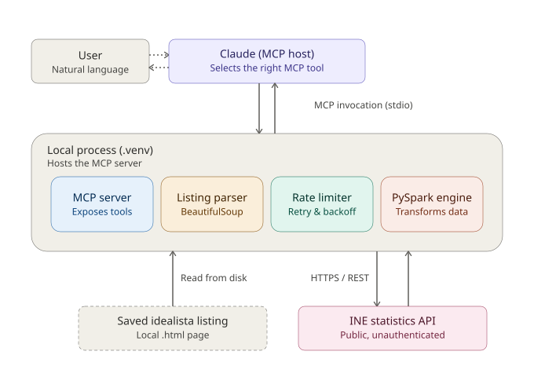

# real-estate-data-platform

An MCP server exposing Portuguese housing and economic indicators from
[INE](https://www.ine.pt) (Instituto Nacional de Estatistica), backed by a
PySpark ingestion layer.



## What's included

### Verified indicators

| Name | varcd | Notes |
| --- | --- | --- |
| `median_price_per_m2` | `0012239` | Median sale price, EUR/m2, quarterly, by NUTS region |
| `number_of_sales` | `0014363` | Housing sales, trailing 12 months, quarterly, by NUTS region |
| `housing_price_index` (IPHab) | `0014765` | Base 2025, quarterly; `dim_3='H1'` for the headline Total |
| `consumer_price_index` (IPC) | `0014640` | Base 2025, monthly level index (for deflating nominal prices); `dim_3='001'` for Total exceto habitacao |

See [ingestion/indicators.py](ingestion/indicators.py) for the full registry
(descriptions, frequency, dimension notes).

All four have a `dim_3` breakdown dimension (e.g. buyer origin, dwelling
category, consumption aggregate). Tools filter to each indicator's
registered "Total" `dim_3` by default so results aren't silently mixed
across categories - pass `dim3` explicitly to see a specific breakdown
instead.

### Tools

| Tool | Purpose |
| --- | --- |
| `list_known_indicators` | See the registry above, with verified flags |
| `get_indicator(varcd, region, dim3, start_year, end_year)` | Generic fetch for any INE indicator by code |
| `get_indicator_raw(varcd)` | Debug: raw unparsed JSON from INE |
| `get_median_price_per_m2(region, start_year, end_year)` | Price data, filterable |
| `get_number_of_sales(region, start_year, end_year)` | Sales data, filterable |
| `get_yoy_change(indicator, region)` | Year-over-year % change |
| `compare_regions(indicator, regions, period)` | Side-by-side region comparison |
| `compute_price_to_income(price_varcd_or_name, income_varcd, region, dwelling_size_m2)` | Affordability ratio - you supply an income indicator's varcd |

### Resources

- `ine://indicators` - the known-indicator registry as JSON
- `ine://indicator/{varcd}` - any indicator's full parsed series as JSON

### A note on INE's API and historical data

INE's `pindica.jsp` endpoint returns exactly one period per call - either
the latest, or a specific one selected via a `Dim1` period code. There's no
single call that returns a full time series. So:

- `get_indicator`/`get_median_price_per_m2`/`get_number_of_sales` with no
  `start_year`/`end_year` do one fetch (latest period only).
- With a year range, `ine_client.py` looks up the matching period codes via
  INE's metadata endpoint and fetches each one individually (capped at 60
  periods per call to keep latency bounded - narrow the range if you hit
  that).
- `get_yoy_change` does two fetches: the latest period, then the matching
  period exactly one year earlier (resolved the same way).

## Prerequisites

- Python 3.11+
- A JDK (Java 17+) - PySpark runs on the JVM and won't start without one.
  Set `JAVA_HOME` to point at it.

### Windows-specific setup

PySpark's Hadoop layer expects a Windows-native `winutils.exe`/`hadoop.dll`
even though this project never touches HDFS. Without it, `SparkSession`
creation fails (or hangs) with errors like
`Could not locate executable null\bin\winutils.exe`.

1. Install a JDK (e.g. [Eclipse Temurin](https://adoptium.net/)) and set
   `JAVA_HOME` to its install directory, e.g.:

   ```powershell
   setx JAVA_HOME "C:\Program Files\Eclipse Adoptium\jdk-17.0.x-hotspot"
   ```

2. Download a `winutils.exe` build matching your Hadoop version (the one
   bundled with the pinned `pyspark==4.2.0` - search
   `winutils <hadoop-version>`, e.g. from
   [cdarlint/winutils](https://github.com/cdarlint/winutils)) and place it
   (plus `hadoop.dll`) under `C:\hadoop\bin\`.
3. Set `HADOOP_HOME` to that folder and add it to `PATH`:

   ```powershell
   setx HADOOP_HOME "C:\hadoop"
   setx PATH "%PATH%;%HADOOP_HOME%\bin"
   ```

4. Open a **new** terminal (env vars set via `setx` only apply to new
   sessions) before running the server or tests.

## Running the server

```bash
pip install -r requirements.txt
python entrypoints/mcp_server.py
```

### Using it from Claude Code

This repo's [.mcp.json](.mcp.json) is checked in (project scope), so cloning
the repo is enough for Claude Code to pick up the `ine-housing-data` server
automatically - no manual `claude mcp add` needed. It points at
`.venv/Scripts/python.exe` (a relative path, resolved from the repo root), so
create the venv there first:

```bash
python -m venv .venv
.venv\Scripts\pip install -r requirements.txt
```

On macOS/Linux, create the venv the same way but update `.mcp.json`'s
`command` to `.venv/bin/python` instead (the `Scripts/python.exe` path is
Windows-specific).

Or, for local development with the MCP inspector:

```bash
mcp dev entrypoints/mcp_server.py
```

To use it from Claude Desktop, add to its MCP server config:

```json
{
  "mcpServers": {
    "ine-housing-data": {
      "command": "python",
      "args": ["entrypoints/mcp_server.py"],
      "cwd": "/absolute/path/to/real-estate-data-platform"
    }
  }
}
```

Note: the server reuses the PySpark `INEClient`, and each fetch produces a
Spark DataFrame that's collected to plain JSON at the tool boundary. A
`SparkSession` is started lazily on first use (not at import), but that
first call will still take a few seconds for the JVM to come up.

## Testing the API/MCP server locally

There's no HTTP endpoint to `curl` - this is a stdio-based MCP server - so
"calling it" means one of the following, in increasing order of how much of
the stack you exercise:

1. **Call `INEClient` directly** - skips Spark and the MCP layer entirely,
   fastest way to check the raw INE API response:

   ```bash
   python -c "from ingestion.ine_client import INEClient; print(INEClient().download('median_price_per_m2'))"
   ```

2. **Run an entrypoint script** - exercises the full `to_dataframe` path
   (Spark included) via [entrypoints/main.py](entrypoints/main.py):

   ```bash
   python entrypoints/main.py
   ```

   This needs the project importable as a package (see Setup below) since
   it does `from ingestion.ine_client import INEClient`.

3. **Call an MCP tool function directly in Python** - bypasses the MCP
   protocol but exercises the same code the server calls:

   ```bash
   python -c "from entrypoints.mcp_server import get_indicator_raw; print(get_indicator_raw('0012239'))"
   ```

4. **Run the real MCP server through the Inspector** - the closest thing to
   how Claude or another MCP client actually calls it, over the real stdio
   transport:

   ```bash
   mcp dev entrypoints/mcp_server.py
   ```

   Opens a local web UI where you can invoke any tool/resource by name.

### Setup for options 2 and 3

`ingestion`/`entrypoints` aren't on `sys.path` by default when a script is
run directly (Python only adds the script's own directory, not the project
root). Install the project in editable mode once so imports resolve
regardless of your working directory or how the script is invoked:

```bash
pip install -e . --no-deps
```

## Example prompts

Once the server is connected in Claude (Desktop or Code), here are prompts
that put these tools to use - e.g. pasting a saved listing page or URL
alongside a question:

**Listing evaluation**
- "Here's another listing [paste HTML/URL] - is the asking price reasonable
  for [neighborhood]?"
- "Compare these two listings I'm considering - which is the better deal
  per m²?"
- "This listing has been on the market for 6 months with no price drop - is
  that normal for this area?"

**Market trend queries**
- "How has the price per m² in [Cascais/Porto/Setubal] changed over the
  last 3 years?"
- "Which municipalities in the Lisbon metro area have seen the fastest
  price growth in the last year?"
- "Is Odivelas overheated compared to neighboring municipalities, or still
  catching up?"
- "Show me the number of sales trend for [region] - is demand rising or
  falling?"

**Affordability / investment framing**
- "If I make €X/year, what price-to-income ratio would a €Y property in
  [region] represent?"
- "At current appreciation rates, what might median price/m² in [region]
  look like in 2 years?"

**Negotiation prep**
- "Given INE data, what's a defensible opening counter-offer for a
  property needing [light/full] renovation?"
- "How much has this specific building's neighborhood repriced since the
  property was likely bought by the current owner (assume ~2018
  purchase)?"

**Raw data / verification**
- "Show me the raw INE API response for [indicator] in [region], no
  formatting"
- "List all known indicators this tool can query"

## Adding more indicators

You don't need to touch code to pull a new INE series - just find its
`varcd`:

1. ine.pt -> Bases de Dados
2. Search for what you want (e.g. "rendas da habitacao", "custos de
   construcao", "ganho medio mensal de trabalho")
3. Open it -> Alterar condicoes de selecao -> switch "Arvore" to "Codigos"
   -> note the `varcd` (and `Dim1`/`Dim2`/`Dim3` codes if you want to filter
   further)
4. Call `get_indicator("that_varcd")` directly, or add a named entry to
   `KNOWN_INDICATORS` in [ingestion/indicators.py](ingestion/indicators.py)
   so it shows up in `list_known_indicators` and can be referenced by name
   in the other tools.

For a mortgage-rate or Euribor series, note that INE isn't the source -
that data comes from Banco de Portugal. A second client would be needed to
wire that up in the same server.
